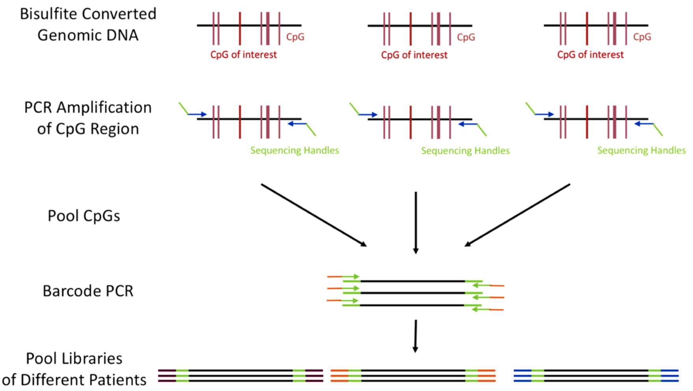
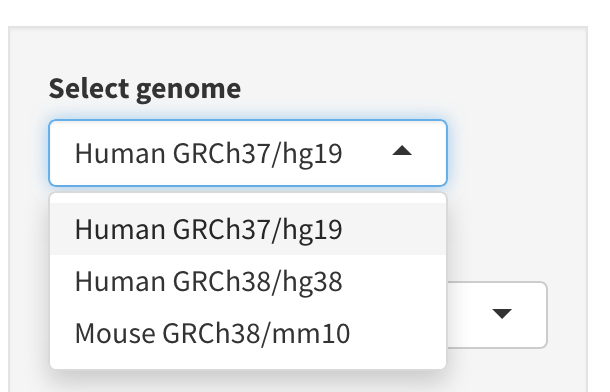
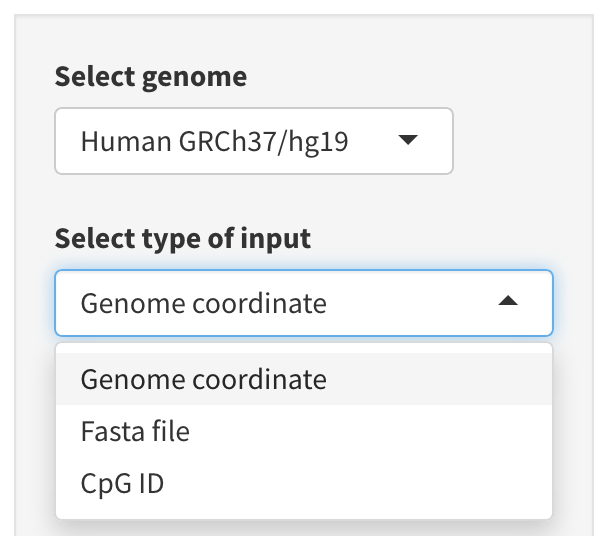
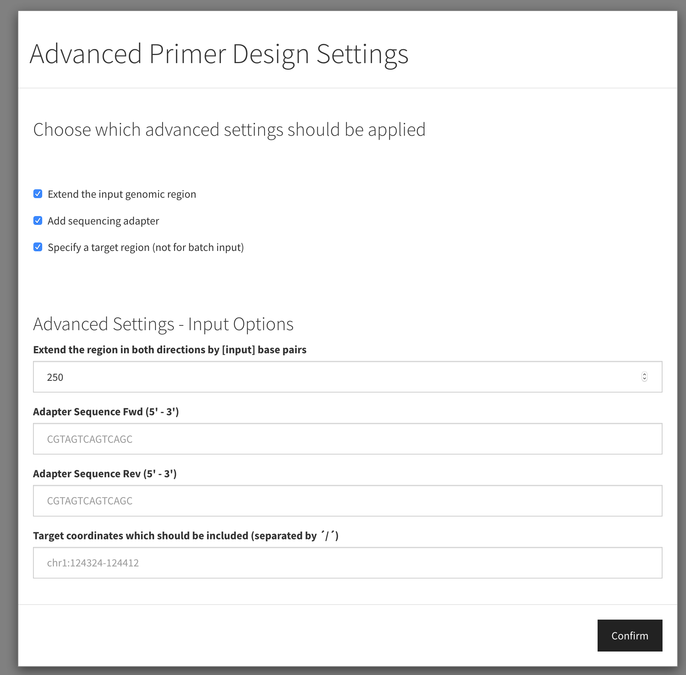
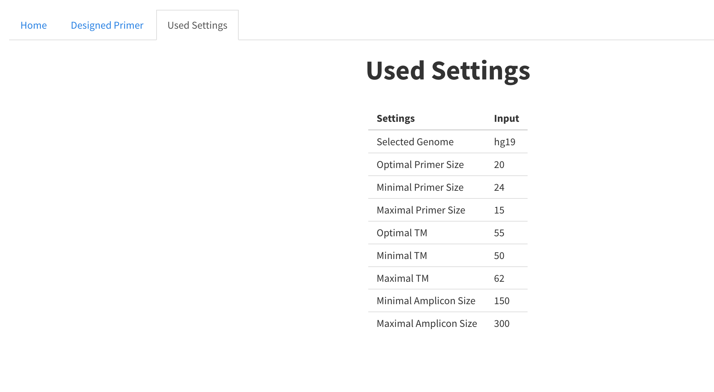
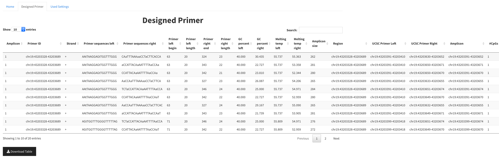

 

### Amplicon Bisulfite Sequencing

Amplcion Bisulfite Sequencing (ampBS-Seq) allows a targeted in-depth analysis of genomic regions by next-generation sequencing. It is currently considered as state-of-the-art for DNA methylation biomarker development and is applied in many clinical and academic research laboratories worldwide (Bock *et al.*, Nature Biotechnology, 2016). In short, the workflow starts with the bisulfite conversion of genomic DNA, followed by PCR amplification of the regions of interest. PCR primers must be specifically designed for bisulfite converted DNA and should not contain CpG dinucleotides. 
The PCR amplicons of each sample are pooled and barcoded which allows the analysis of several sample on one sequencing lane. A bioinformatic analysis can then distinguish between methylated and unmethylated CpGs due to the bisulfite conversion of unmethylated CpG to uracil.  

 
 

### Tutorial: Primer Design for ampBS-Seq

 

#### 1.) Select the required genome build
AmpliconDesign currently supports three common genome builds: GRCh38/hg38, GRCh27/hg19 and GRCm38/mm10.  
Select the required genome in the drop-down menu. 

 
 

#### 2.) Select the input
AmpliconDesign supports CpG-IDs, Genome Coordinates or FASTA files as single or batch input.
CpG-IDs or Genome Coordinates have to be slash ('/') separated for batch input.  

*FASTA files:* FASTA file input accepts standard FATSA files with one or more sequences. The genomic location of the sequence in the fasta file must be specified in the header [(Example: >chr19:43203368-43203369)](https://github.com/MaxSchoenung/amplicondesign/blob/master/test_fasta.fasta)  

*Genome Coordinate:* Genomic Coordinates of the CpG site of interest can be inserted. NOTE: No comma separation! (Example: chr19:43203368-43203369)

*CpG ID:* The genome assembly hg19 allows the input of CpG-IDs. (Example: cg04882394)

 
 

#### 3.) Bisulfite Convert
Choose this option to bisulfite convert FASTA files first. For already bisulfite converted sequences: Capital Letter T indicates non-conversion derived thymins and lower case t for bisulfite conversion derived tymins.

 
 

#### 4.) Primer Size
Choose the optimal, minimal and maximal primer size.

 

#### 5.) Melting Temperature
Choose the optimal, minimal and maximal primer melting temperature.

 

#### 6.) Amplicon Size
Choose the minimal and maximal amplicon size.

 

#### 7.) Number of Primer to design
Choose how many primers to design per inserted genomic region.

 

#### 8.) Advanced Setting: 

##### Extend the input genomic region

The selected genomic regions can be extended by the chosen number of base pairs in both directions *(not for FASTA)*.
 

##### Add Sequencing Adapter

Add sequencing adapter 5' of the primer sequence. Adapter sequences can be specified as Adapter Sequence Fwd and Adapter Sequence Rev if this option is selected.
 

##### Specify a target region (not for batch input)

For a single genomic region users can specify the position (either genome coordinate or relative base pair position of the amplicon) which should be covered in the amplicon.
 

 
 

#### 9.) Overview of used Settings

After submitting the primer design job to the AmpliconDesign web server, users can re-evaluate their chosen settings in the *Used Settings* section.
 

 
 

#### 10.) Evaluating the Results

AmpliconDesign generates a table with automatically designed primers. This table includes the primer sequence for the plus strand (Amplicon 1) and the minus strand (Amplicon 2) of each amplicon. The primer ID is given as the specified input region. Primer sequences for the forward and reverse primer are predicted (whereby t corresponds to bisulfite converted C). The primer begin is given with respect to the amplicon start site, followed by the GC content of the primer, melting temperatures and the total amplicon size. The *Region* column repeats the input region, and the UCSC coordinates for the forward and reverse primer (left and right) are given, as well as the final amplicon coordinates and the number of CpGs in each amplicon (#CpGs). 

 

Users can choose a primer pair by clicking on a row of the table. A pop-up window opens with a genome region plot, indicating primer binding sites, SNP, transcript and CpG locations within the specified region.

 

### Interactive Data
Data can be loaded and interactively explored.

 
