

 

### Targeted DNA methylation analysis by MassArray

The MassARRAY® System by Agena Bioscience allows a mass-spectrometry based analysis of DNA methylation patterns with single CpG resolution. The system offers a low-cost
alternative and allows users to analyze DNA methylation of even formalin-fixed paraffin-embedded (FFPE) tissue. In short, the procedure begins with a bisulfite conversion of isolated genomic DNA from samples of interest. Thereby, unmethylated cytosines are converted to uracil residues while methylated cytosines are not affected. This ensures a difference in mass which can later on be analyzed by mass-spectrometry. A PCR amplification of the region of interest with a T7-promoter-tagged reverse primer is performed and the resulting fragments are in vitro transcribed. The latter process leads to an incorporation of uracil residues which generates a RNase cleavage pattern in the respective fragments. The fragments can be analyzed by the MassArray MALDI-TOF spectrometer and differ in mass due to the bisulfite treatment.

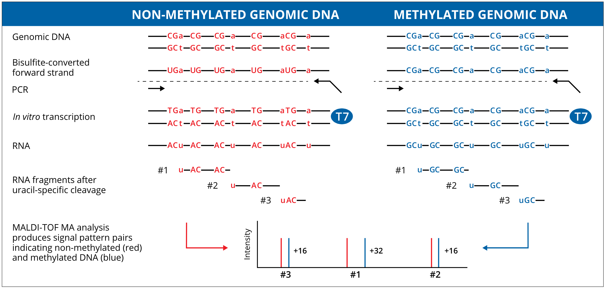

Source: "http://agenabio.com/wp-content/uploads/2015/06/51-20055R1.0-EpiTYPER-Brochure_WEB.pdf"

 

### MassArray primer design 

The MassArray primer design process requires several prerequesits compared to normal DNA primer design. First, it has to be assessed whether the analyzed CpGs are located within 
amplicons which show a mass difference in the MassArray workflow. CpGs which are located in fragments with an overlapping molecular weight (MW) cannot be analyzed as users will not be able to differentiate between CpGs in fragments with a mass-overlap. Second, it has to be determined which strand (Watson or Crick) has more CpG containing fragments which can be analyzed by MassArray. Bisulfite treatment destroys the complementary of both strands so that primers have to be specifically designed for either the coding (Watson) or non-coding (Crick) strand. And third, primers have to be designed for bisulfite converted DNA which requires adjusted primer design parameters.  
Considering those prerequesits, MassArray primer design can be considered a tedious process. Users have to extract the genomic DNA sequence for the amplicons of interest, bisulfite convert the conding and non-coding strand in-silico, assess wether CpGs can be detected by MassArray and then design primer pairs. *AmpliconDesign* offers an all-in-one solution which extracts genomic DNA sequences from common reference genomes, analyzes fragment cleavage patterns, bisulfite converts DNA in-silico and returns a list of suggested primer pairs. Users solely have to provide the genomic coordinates of interest. A graphical output is generated which allows users to select the best primer pairs for MassArray. 

 
 

### Tutorial: Primer Design for MassArray

 

#### 1.) Select the required genome build
AmpliconDesign currently supports three common genome builds: GRCh38/hg38, GRCh27/hg19 and GRCm38/mm10.  
Select the required genome in the drop-down menu. 

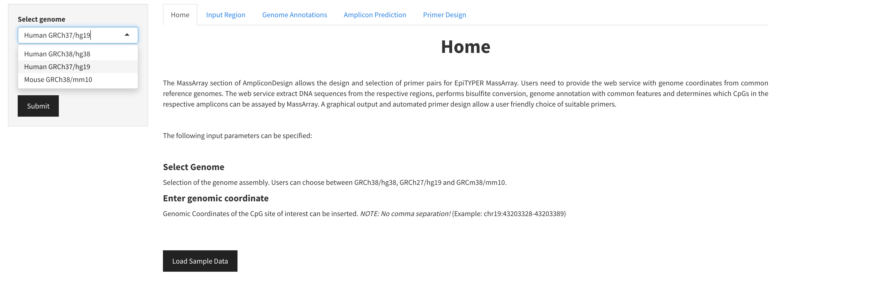

 
 

#### 2.) Enter the coordinates of the genomic region of interest
The genomic regions of interest have to be entered in the form of genome coordinates (e.g. chr19:43203328-43203389)  
Genomic regions can be further extended within the primer design workflow.  
*Do neither comma separate the numbers nor add a white space before the coordinates*

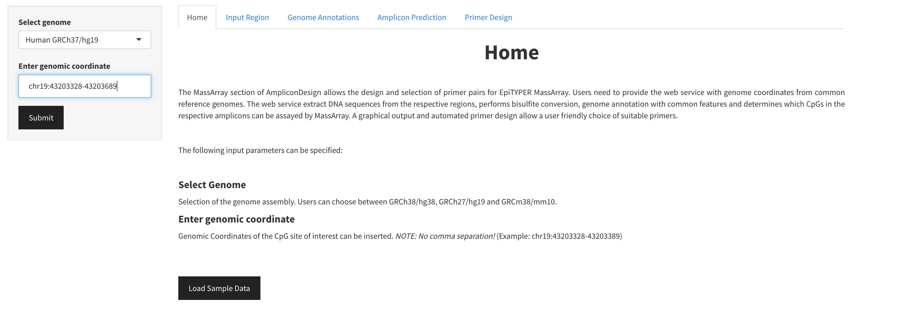

 
 

#### 3.) Inspect your Input Region
AmpliconDesign extract the region of interest from the reference genome and provides the user with the DNA sequence of the Watson (forward sequence) and Crick strand (reverse complement sequence).
Users can furthermore inspect their input region in a tabular format. A slider allows the extension of the input region. The shown DNA sequences provide the user furthermore with information about repeat regions (green), SNP positions (violet) and CpG dinucleotides (red).

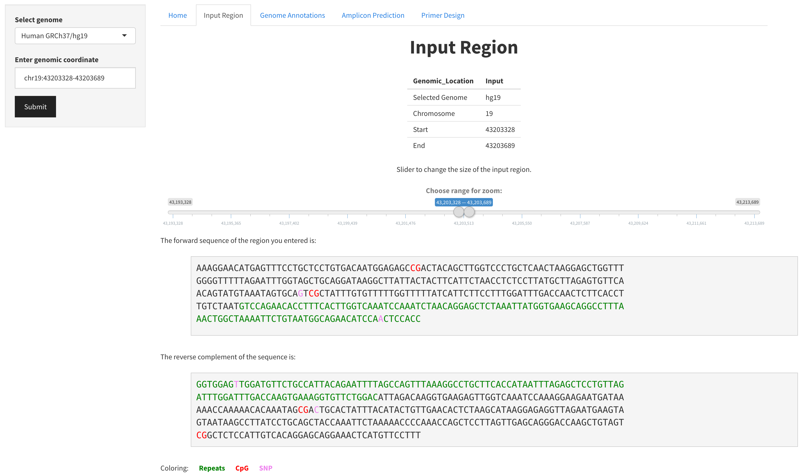

 
 

#### 4.) Plot with Genome Annotations
Users can inspect the analyzed genomic region in a plot which includes transcript, SNP, CpG and repeat positions. The page furthermore includes a tabluar output which lists all the CpGs in the analyzed fragment.

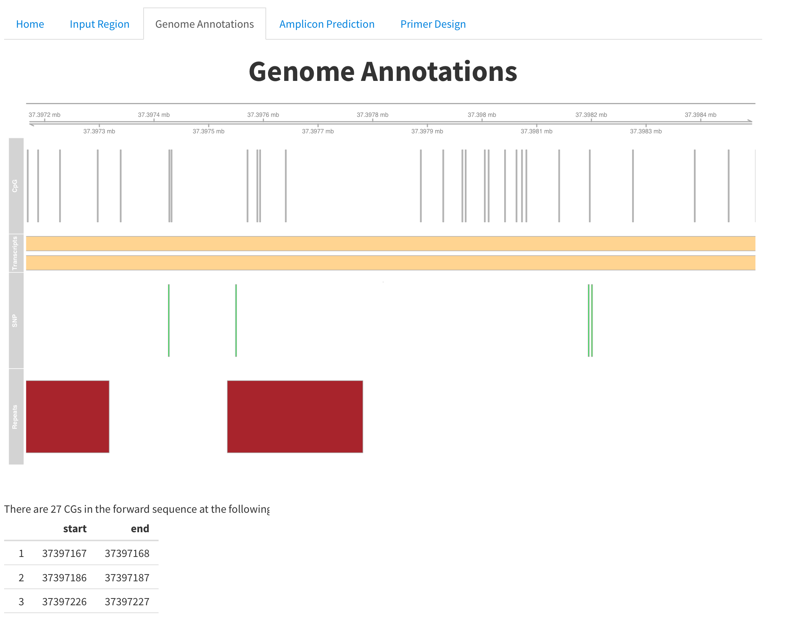

 
 

#### 5.) Analyze the *in-silico* Fragmentation
The amplicon prediction plots have been adapted from the MassArray R package ([Thompson RF, Greally JM (2018). MassArray: Analytical Tools for MassArray Data. R package version 1.34.0.](https://bioconductor.org/packages/release/bioc/html/MassArray.html)). The initial table shows in a binary format which of the covered CpGs can be analyzed by MassArray. 
The "summary" column inidicates whether a CpG is covered by putative fragments (1 = detectable; 0 = not detectable). The other columns show in which cleavage (C or T cleavage) and on which strand (+ or -) the CpG can be analyzed. It is crucial that users furthermore check the amplicon prediction plots below. Those show the putative fragments and the location of CpGs (filled circle). CpGs within a blue fragment can be uniquely analyzed in the MassArray workflow. Red fragments show overlaping molecular weights (MWs) with another fragment. Grey fragments are outside of the testable mass window. Black fragments do not contain a CpG but are uniquely assayable. Green fragments might contain a conversion control. An overlapping MW between CpG containing fragments is shown by linked arrowheads.

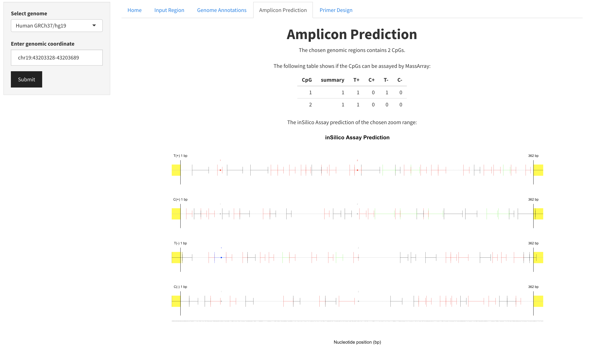
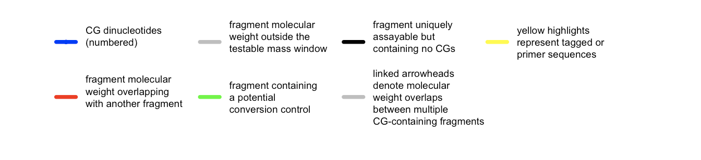

 
 

#### 6.) Manual Primer Design
AmpliconDesign offers the possibility to manually design MassArray primers. Therefore users can select between the Watson and Crick strand, depending on the number of CpGs which are covered. In general it is recommended to select the strand with the highest number of fragments that can be analyzed by MassArray. A selector for the coding strand and one for the non-coding strand allows to mark the putative primer sequence in the genomic region. Please make sure that primer sequences do not overlap with CpGs or SNP (if unavoidable place them in the 5' position). The first sequence always shows the 5'-3' direction of the coding strand. So if the Watson strand is selected, this corresponds to the bisulfite converted coding strand. If the Crick strand is selected, this corresponds to the reverse complement of the Crick strand. This visualization is required to ensure the integrity of the genome annotations. The second sequence always shows the 3'-5' orientation. In case of the Watson selection, the complement of the bisulfite converted coding sequence and in case of the Crick, the bisulfite converted reverse Crick strand (3'-5').

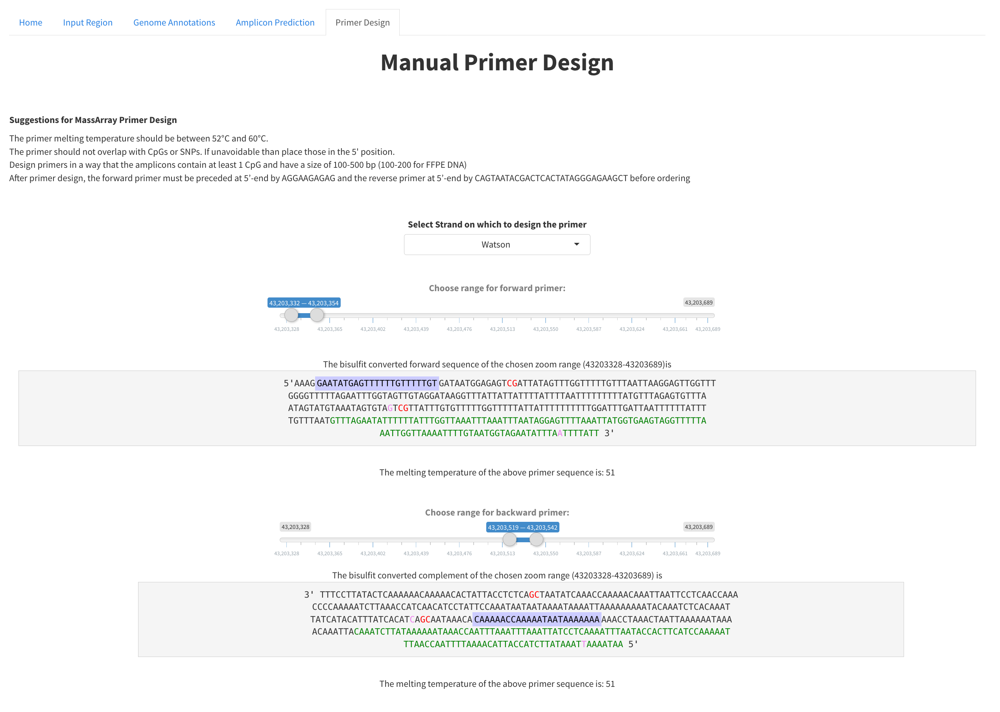

 
 

The selected primer pair is shown in a table in a ready to order fashion. The table shows the forward primer and reverse primer in the correct orientation. Please ensure to add a T7-promoter tag to the primer of choice before ordering the primers for MassArray. The table furthermore shows primer sizes and the final amplicon size.

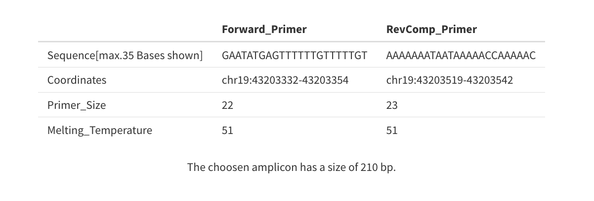

 
 

#### 7.) Automated Primer Design
AmpliconDesign furthermore offers the possibility to automatically design primers by calling primer3 (Untergasser *et al.*, NAR, 2012) with bisulfite adjusted parameters. Several input parameters have to be specified to allow a user-specific primer design:  

##### Primer Size
Choose the optimal, minimal and maximal primer size.
 

##### Melting Temperature
Choose the optimal, minimal and maximal primer melting temperature.
 

##### Amplicon Size
Choose the minimal and maximal amplicon size.
 

##### Exclude CG from primer
Recommended: Choose this option to exclude CG dinucleotides from the primer sequence.
 

##### Include CpGs in the region
Users can choose if the covered CpGs should be included in the amplicon.

 
 

#### 8.) Table with automatically designed primers
AmpliconDesign generates a table with automatically designed primers. This table includes the primer sequence for the plus strand (Amplicon 1) and the minus strand (Amplicon 2). The primer ID is given as the specified input region. Primer sequences for the forward and reverse primer are predicted (whereby t corresponds to bisulfite converted C). The primer begin is given with respect to the amplicon start site, followed by the GC content of the primer, melting temperatures and the total amplicon size. The *Region* column repeats the input region, and the UCSC coordinates for the forward and reverse primer (left and right) are given, as well as the final amplicon coordinates and the number of CpGs in each amplicon (#CpGs). 

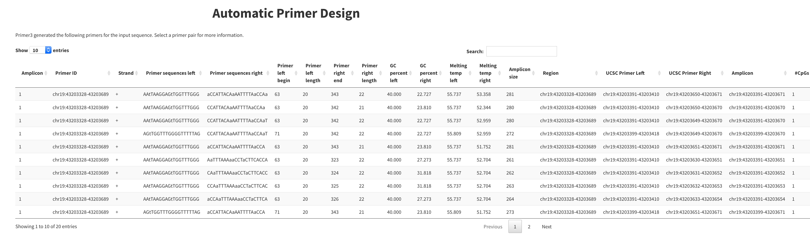

 

An overview of the putative fragment patterns, including MW, number of covered CpGs and collision (MW overlap with another fragment) are shown for each primer pair when clicking on a row in the primer table. Thereby users can check if their CpG of interest can be analyzed by MassArray.

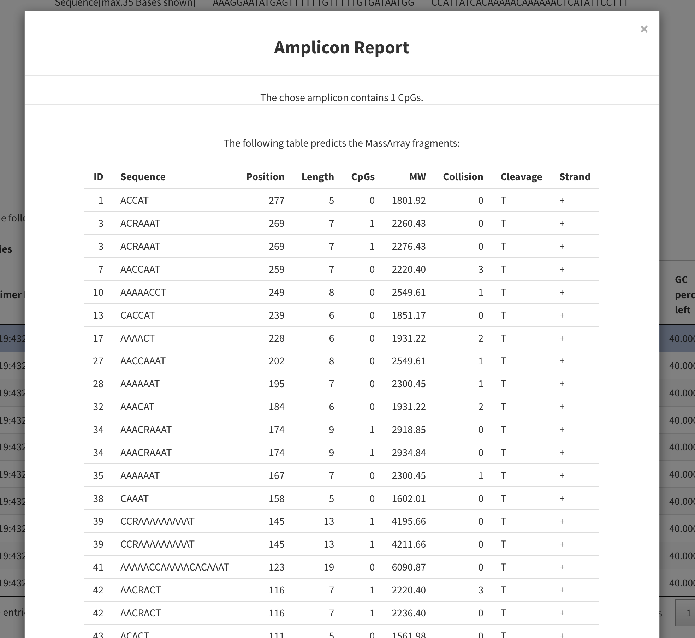

 
 

#### 9.) Download of the data
AmpliconDesign allows a download of the data and provides the user with all previously specified information, including selected primer sequences and a table with the automatically designed primer pairs.

 

### Interactive Data
Data can be loaded and interactively explored.

 
